WebGL Clustered Deferred and Forward+ Shading
======================

**University of Pennsylvania, CIS 565: GPU Programming and Architecture, Project 5**

* Aman Sachan
* Tested on: Windows 10, Intel(R) Xeon(R) CPU E5-1630 v4 @ 3.7GHz (8 CPUs) 32GB RAM, 
			GTX 1070 8081MB (Lab Machine)

## [Try it Live!](https://amansachan1.github.io/WebGL-Clustered-Deferred-Forward-Plus/)

## Demo Video

[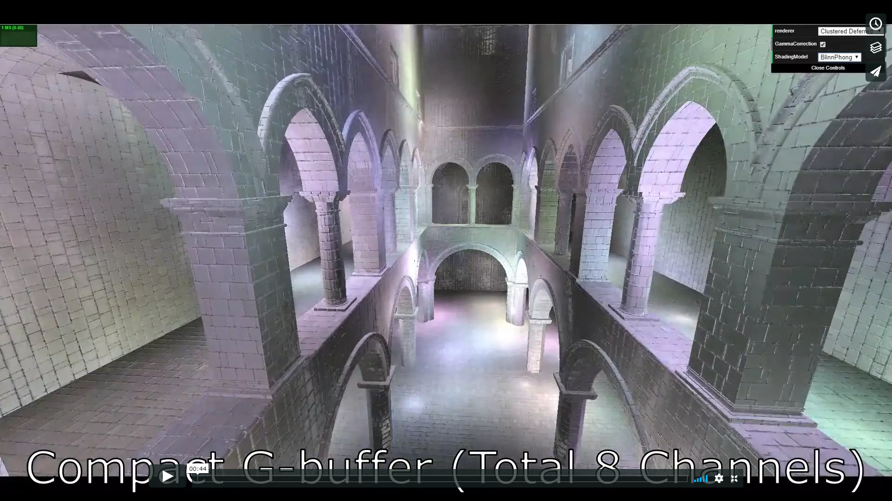](https://vimeo.com/240254058)

#### _The demo above has about 300 dynamic lights. The Clustered Deferred Shading model implemented here can handle more than 2100 lights at 60 FPS but this over saturates the scene._

## OverView

This project implements Clustered Deferred and Clustered Forward Shading Techniques. These techniques improve performance for scenes with many dynamic lights. Typical forward shading involves looping over every object and then looping over every single light in the scene to accumulate the light energy on the object. If the number of lights is high, this can lead to a drastic drop in performance. We need to cull lights so that only those lights which actually contribute energy on a fragment are looped over. Clustering is a solution that bins lights into 3D buckets based on what the light can influence. Deferred shading is an improvement over this by only dealing with the fragments with the smallest z-depth, which is accomplished via a culling stage and using a "g-buffer".

These solutions allow you to have an enormous number of dynamic lights in the scene when optimized. This project can run over 2100 lights at 60 FPS.

## Features

_A much more in depth explanation of the shading models and clustering can be found [here](http://amansachan.com/webpages/projects.html#Modal_ClusteredDeferredShading)._

### Forward Shading Model

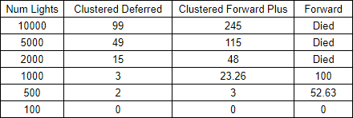

A typical forward shading pipeline loops over every object and then inside that loops over all the lights in the scene to accumulate the light energy on the object. If the number of lights is high, this can lead to a drastic drop in performance.

As seen in the charts above forward shading takes a massive hit in performance as you increase the number of dynamic lights in the scene. At around 2000 lights it doesnt even run.

### Clustered Forward+ Shading Model

Forward Plus is a shading technique that involves culling lights in some fashion and then binning them in either 2D tiles or as was done in this project 3D clusters. This means that there is overhead for light culling but the payoff during shading is enormous. Culling lights means every fragment looops through only a select few lights in relation to the entire scene instead of all the lights.

The preformance can be many folds as the number of lights in the scene increase. About 17-18 times at 500 lights as compared to forward shading.

The graphs show at a 1000 lights that forward plus is only about 5 times faster than forward shading. This is much better ofcourse but isn't as great as 17. This might be because of the cluster texture not fitting well into memory leading to many expensive calls to global memorry during shading. 

### Clustered Deferred Shading Model

Deferred shading is an improvement over forward plus shading. It has 2 render passes, the first one looping over fragments and creating a "g-buffer" that stores only the topmost fragment, ie the one with the smallest depth, and storing the data associated with it in a single or multiple buffers. This data can be whatever is required for shading such as positions, colors, normals, depth, specular, etc.

Not having to loop over all the the fragments for a pixel and perform light accumulation on all the fragments leads to massive performance boosts even over forward plus. This boost is anywhere from 2 to 8 times more. The performance can be improved by using smaller and more data-coherent textures and so compact g-buffers.

The performance of both clustered forward plus and deffered shading is heavily dependent upon the size of the cluster buffer which is based mainly on how many clusters and the maximum number of lights that can be stored in the cluster. Making this texture data coherent goes a long way towards making the shading technique run really fast. This however is hard to know intuitively and was more of a guessing process. 

### Clustering

Clustering is the binning technique used to store lights in a spatial data structure based on their area of influence. Clusters arent simply called grids because they are made y slicing up the camera view frustum, which makes each cluster a tiny frustum. Frustum based culling is hard (false positives are easy) but there are many ways to go about it based on how accurate you need to be.

#### [Fast Frustum Culling](http://gamedevs.org/uploads/fast-extraction-viewing-frustum-planes-from-world-view-projection-matrix.pdf)

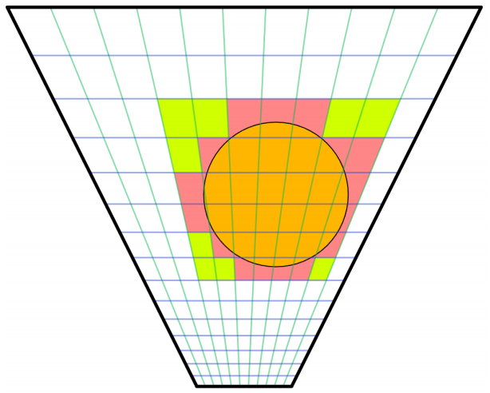

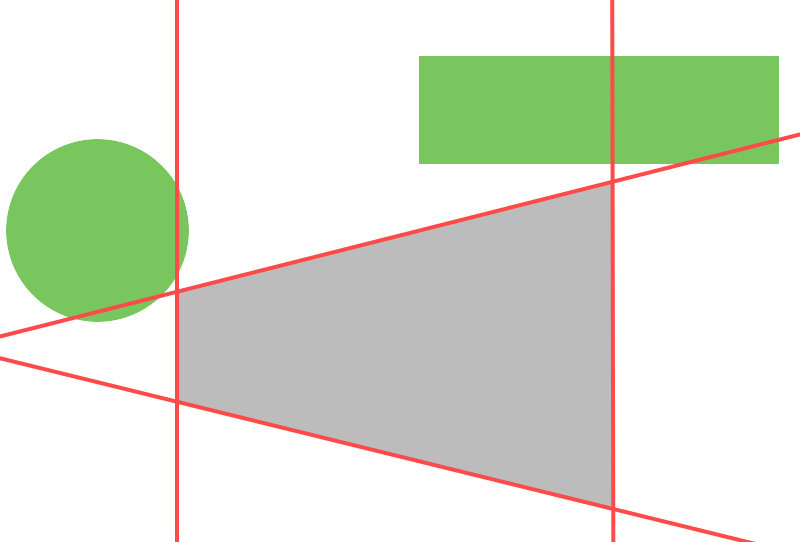

The clusters used in this project were uniformly spaces in z, and were slicing the view frustum into 15 sections along each dimension. The number of slices per plane affects the size of the cluster buffer and so is a good number to play around with. Additionally it may be beneficially to have exponential or some other way of splitting up the z dimension, because usually in real-time applications things in the distance are sampled at lower resolutions. This is something that can and has been taken advantage of, for example the game doom implemented an exponential divisioning of the z dimension.

### Optimizations

#### Using Two G-buffers (use total 8 channels) - Pack values together into vec4s

Reducing the number of g-buffers helps make deferred shading faster which can be done by compactly storing data in them. Colors often dont need the alpha component, normals can be reconstructed simply from 2 of their components, data can be stored in 24bit floats instead of 32 bits, are just some of the ways to achieve this compression.

This project implemented the following layout for the 2 g-buffers used:

R-Channel | G-Channel | B-Channel | A-Channel
--------- | --------- | --------- | ---------
Position.x | Position.y | Position.z | Normal.x
Color.x | Color.y | Color.z | Normal.y

#### 2 Component Normals

If we assume the magnitude of a normal is one, which it usually is because its simply a direction vector. We can reconstruct the z-value of the normal from its x and y values. The magnitude of a vector is defined as the square root of x squared + y squared + z squared. This formula gives us the magnitude of z. The sign of z is positive in camera space for all the fragments that we can see. Using these 2 bits of information we can easily reconstruct the normal from only its x and y components.

### Effects
#### Toon Shading

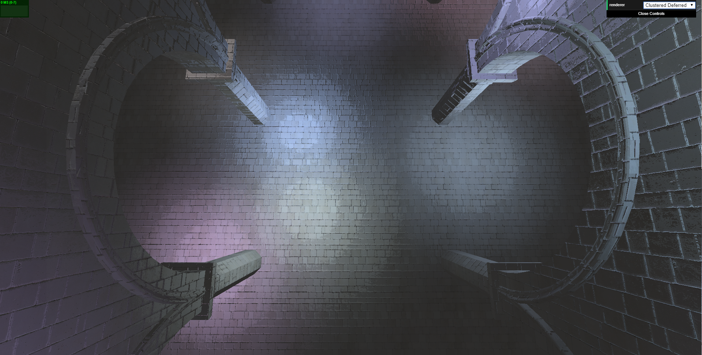

#### Blinn-Phong

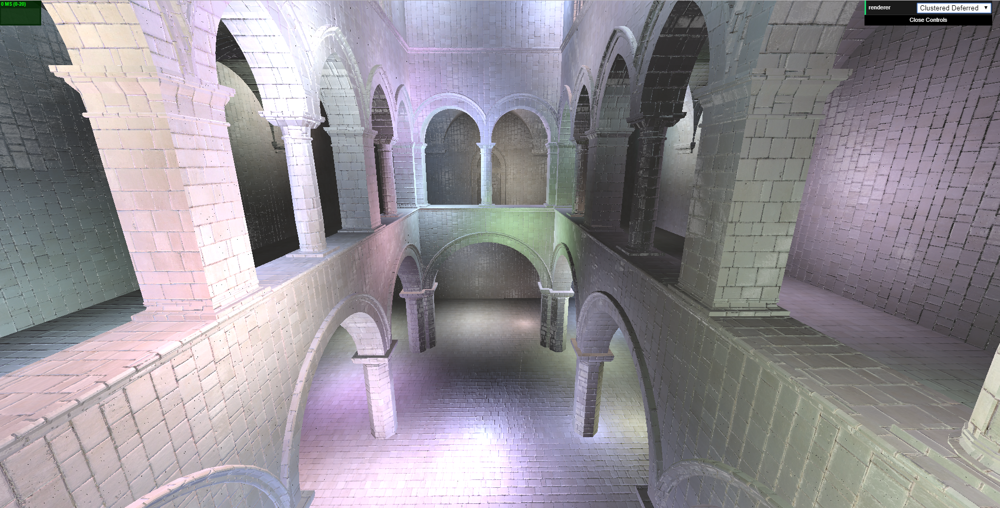

#### Gamma Correction

With | Without
---- | -------
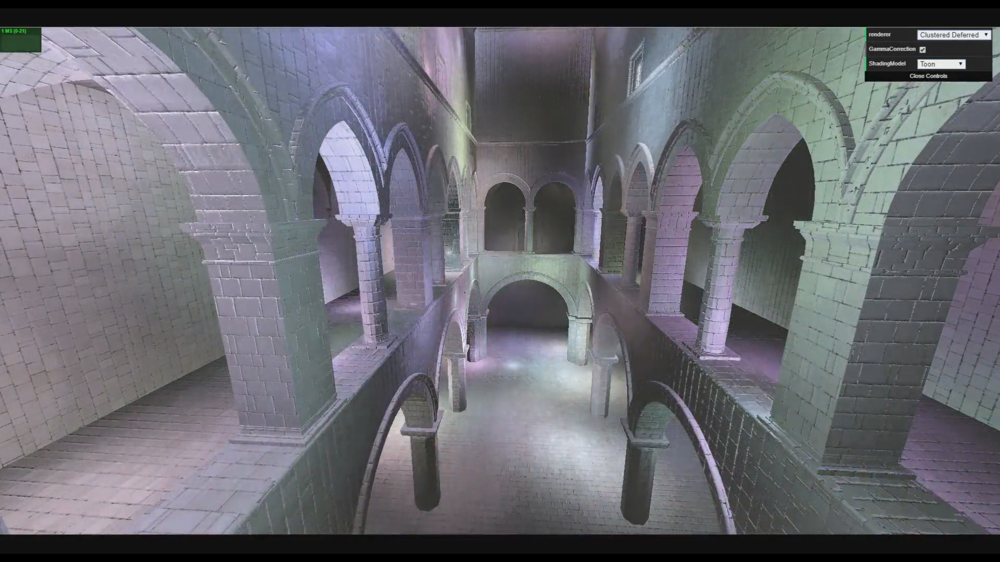 | 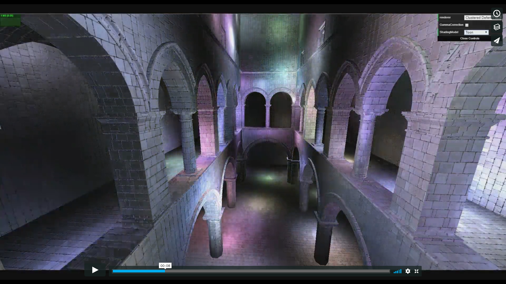

## Debug Views

Fragment X Cluster | Fragment Y Cluster | Fragment Z Cluster
------------------ | ------------------ | ------------------
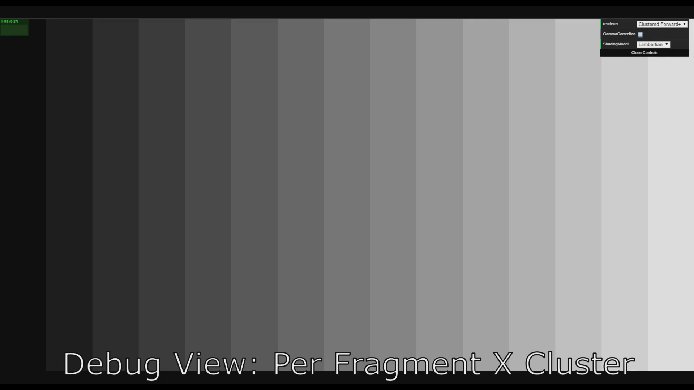 | 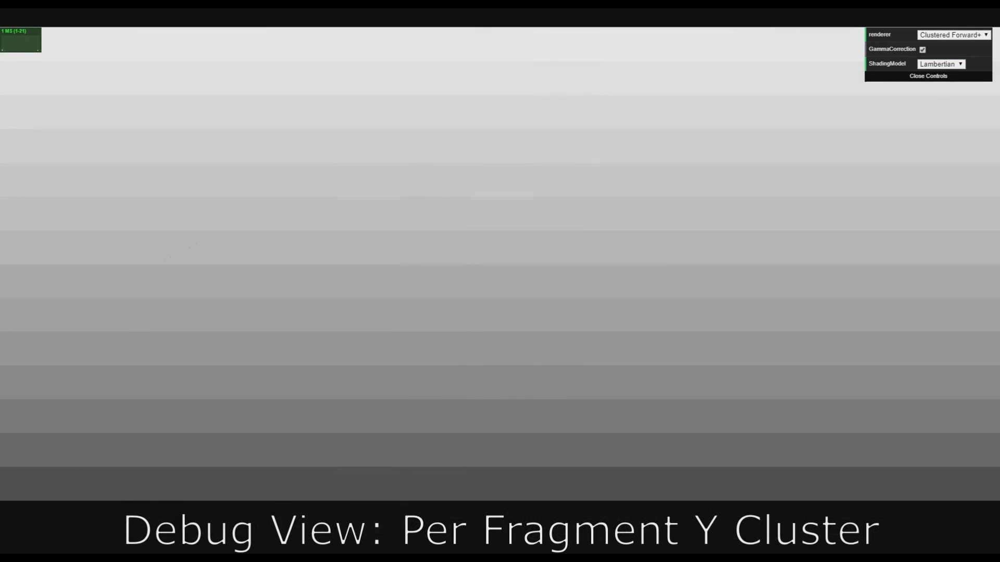 | 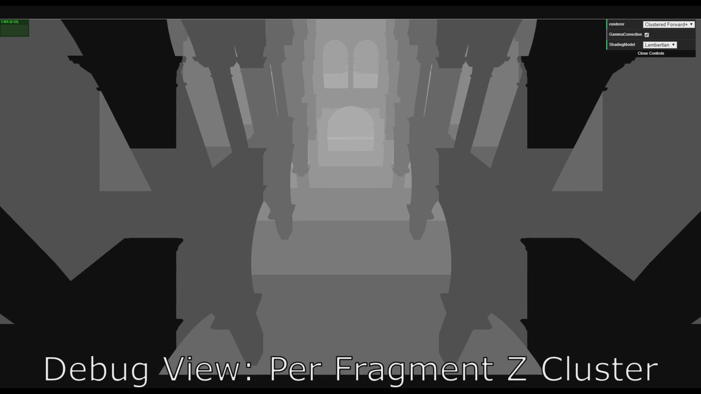

Fragment u coordinate | Lights Per Cluster | Arbitray Light Value Per Cluster
------------------ | ------------------ | ------------------
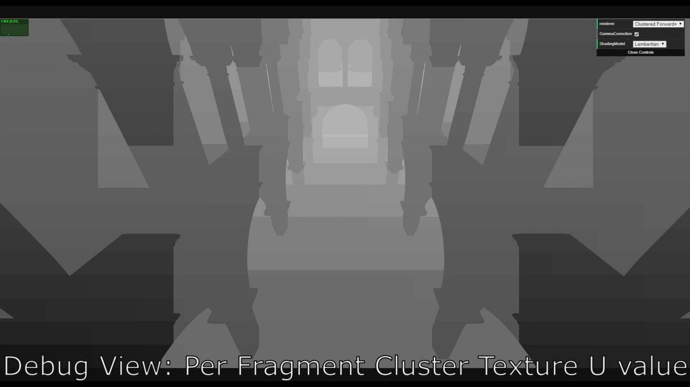 | 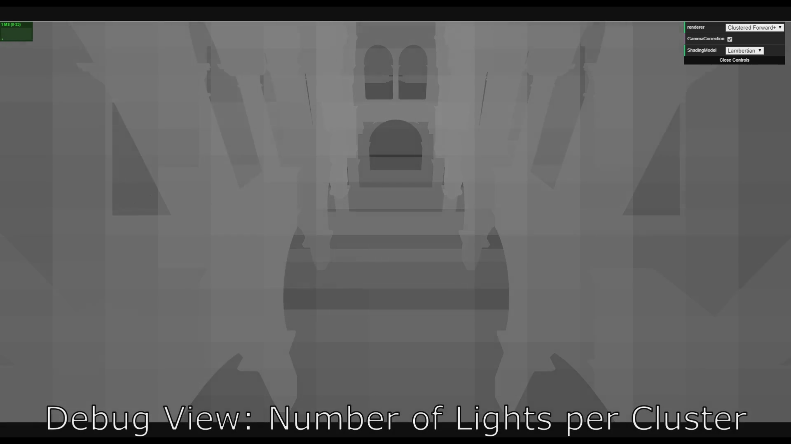 | 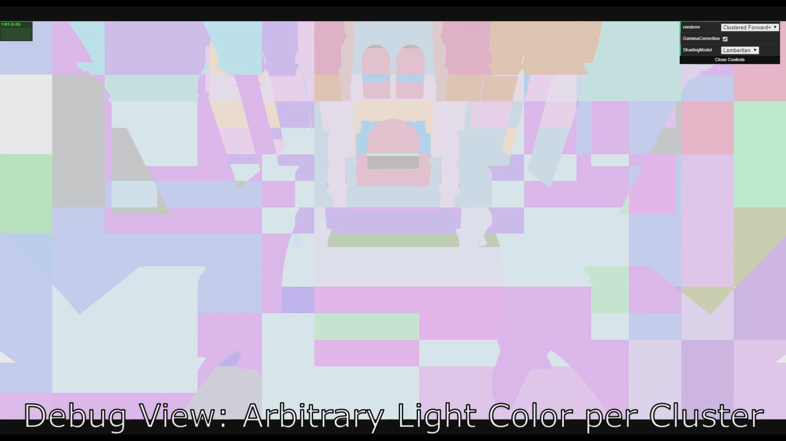

Fragment Depth | Fragment World Space Position | Normals | Albedo
-------------- | ----------------------------- | ------- | ------
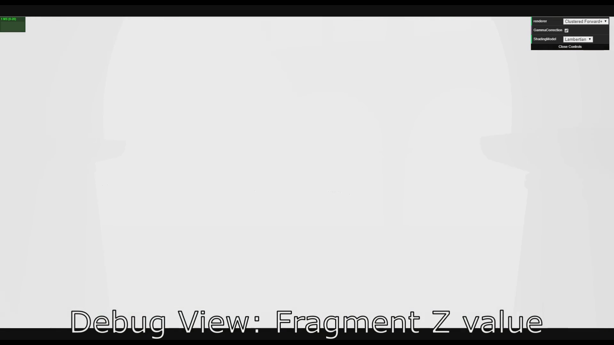 | 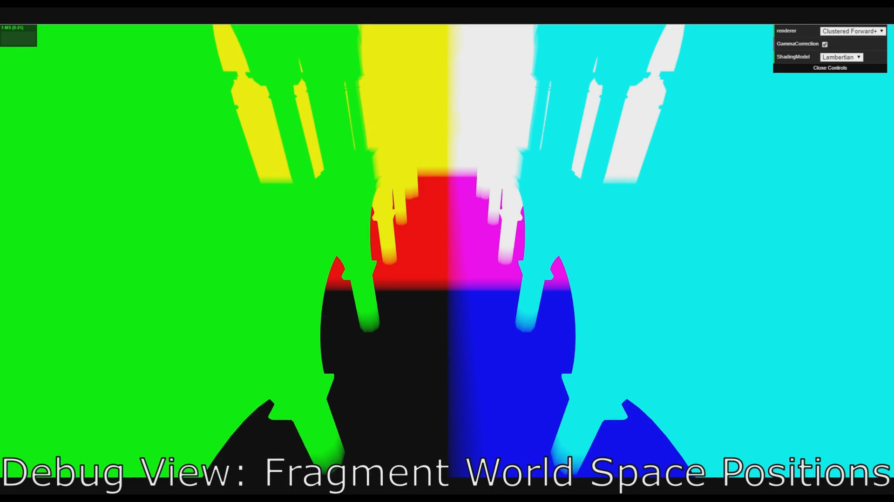 | 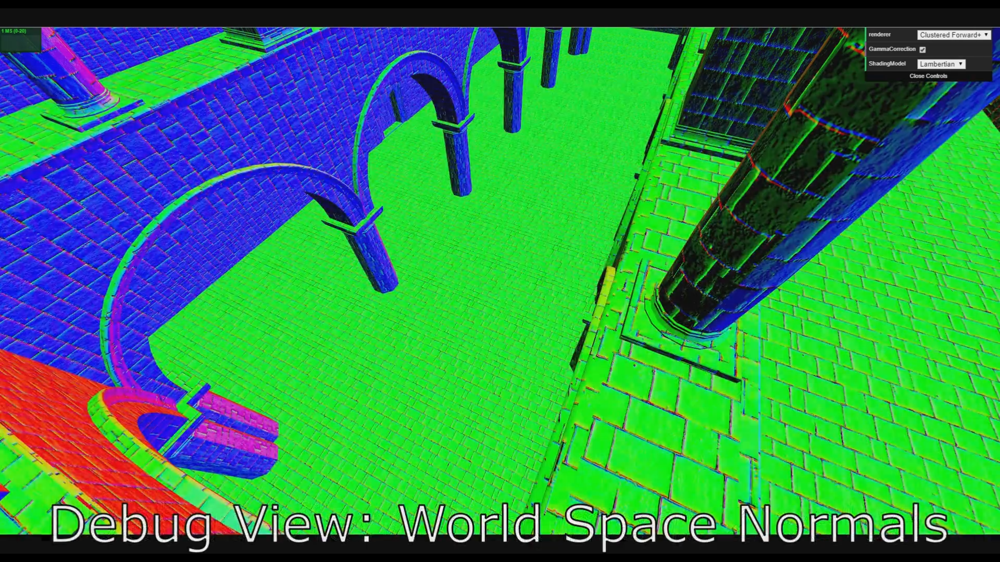 | 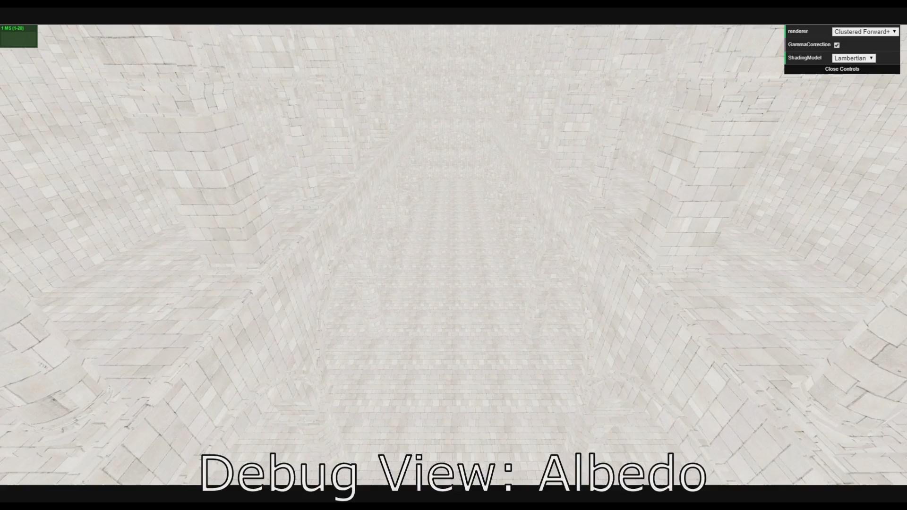

## Credits

* [Three.js](https://github.com/mrdoob/three.js) by [@mrdoob](https://github.com/mrdoob) and contributors
* [stats.js](https://github.com/mrdoob/stats.js) by [@mrdoob](https://github.com/mrdoob) and contributors
* [webgl-debug](https://github.com/KhronosGroup/WebGLDeveloperTools) by Khronos Group Inc.
* [glMatrix](https://github.com/toji/gl-matrix) by [@toji](https://github.com/toji) and contributors
* [minimal-gltf-loader](https://github.com/shrekshao/minimal-gltf-loader) by [@shrekshao](https://github.com/shrekshao)
